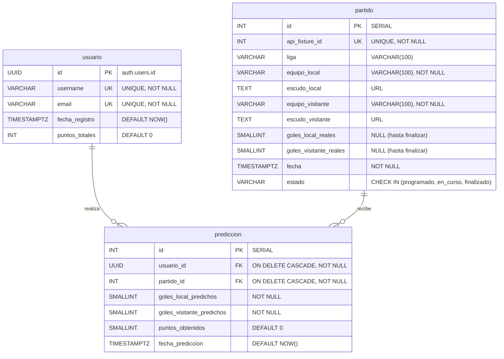

# Documentación de Base de Datos - FutScore

Este documento contiene la especificación técnica detallada de la base de datos de **FutScore** (Trabajo Práctico Final - Base de Datos 1, Universidad de Belgrano).

El sistema utiliza **Supabase** (que corre sobre el motor relacional **PostgreSQL**) como backend y base de datos, implementando gran parte de la lógica de negocios directamente en el motor relacional a través de **Triggers**, **Funciones PL/pgSQL**, e **Índices** y **Vistas**, cumpliendo con los estándares rigurosos de la materia.

---

## 1. Diagrama de Entidad-Relación (DER)

A continuación se muestra el modelo relacional diseñado para el sistema de predicciones (Prode) de FutScore, representado con sintaxis de Mermaid:



### Análisis de Relaciones y Cardinalidad

1. **`usuario` 1 ── 0..N `prediccion` (Uno a Muchos)**:
   * **Cardinalidad**: Un usuario puede registrar desde **0 hasta N** predicciones en la plataforma. Por su parte, cada predicción pertenece a **exactamente un** usuario.
   * **Integridad Referencial**: Se implementa a través de la clave foránea `usuario_id` que apunta a `usuario(id)`. Cuenta con la cláusula `ON DELETE CASCADE`: si el usuario es eliminado del sistema, todas sus predicciones son borradas en cascada para evitar registros huérfanos.

2. **`partido` 1 ── 0..N `prediccion` (Uno a Muchos)**:
   * **Cardinalidad**: Un partido de fútbol puede ser predicho por **0 a muchos** usuarios diferentes. A su vez, una predicción está vinculada a **exactamente un** partido.
   * **Integridad Referencial**: Se modela mediante la FK `partido_id` referenciando a `partido(id)` con `ON DELETE CASCADE` (si se depura un partido antiguo, se limpian sus predicciones).

3. **Relación Muchos a Muchos (N:M) entre `usuario` y `partido`**:
   * Esta relación está físicamente rota mediante la tabla asociativa **`prediccion`**.
   * **Restricción Clave (Anti-Trampa)**: Para asegurar que un usuario **no pueda realizar múltiples apuestas** sobre un mismo partido, se define una clave única compuesta de tabla: `CONSTRAINT uq_usuario_partido UNIQUE (usuario_id, partido_id)`. Esto bloquea a nivel de motor de base de datos cualquier intento duplicado.

---

## 2. Diccionario de Datos (Columnas y Atributos)

### 2.1. Tabla: `usuario`

Almacena el perfil público de los participantes del Prode. El `id` se sincroniza automáticamente con el sistema de autenticación de Supabase.

| Nombre de Columna | Tipo de Datos | Claves | Restricciones / Atributo Especial | Descripción |
| :--- | :--- | :---: | :--- | :--- |
| **`id`** | `UUID` | **PK** | Vinculado a `auth.users.id` | Identificador único provisto por el sistema de Auth. |
| **`username`** | `VARCHAR(50)` | **UK** | `NOT NULL`, `UNIQUE` | Nombre visible del usuario (único en el sistema). |
| **`email`** | `VARCHAR(150)` | **UK** | `NOT NULL`, `UNIQUE` | Correo electrónico de registro. |
| **`fecha_registro`**| `TIMESTAMPTZ` | - | `DEFAULT NOW()` | Fecha y hora en la que el usuario se registró. |
| **`puntos_totales`**| `INT` | - | `DEFAULT 0` | Acumulador de puntos del jugador. Calculado de forma reactiva. |

---

### 2.2. Tabla: `partido`

Contiene la información de los encuentros. Es la fuente de la verdad para calcular los puntos del prode.

| Nombre de Columna | Tipo de Datos | Claves | Restricciones / Atributo Especial | Descripción |
| :--- | :--- | :---: | :--- | :--- |
| **`id`** | `INT` | **PK** | `SERIAL` (Autoincremental) | ID interno de control correlativo. |
| **`api_fixture_id`**| `INT` | **UK** | `NOT NULL`, `UNIQUE` | ID único externo provisto por la API de fútbol. Evita duplicados en sincronización. |
| **`liga`** | `VARCHAR(100)`| - | - | Nombre de la liga (ej: *Premier League*, *La Liga*, *Mundial*). |
| **`equipo_local`** | `VARCHAR(100)`| - | `NOT NULL` | Nombre de la escuadra local. |
| **`escudo_local`** | `TEXT` | - | - | URL a la imagen o logo del club local. |
| **`equipo_visitante`**| `VARCHAR(100)`| - | `NOT NULL` | Nombre de la escuadra visitante. |
| **`escudo_visitante`**| `TEXT` | - | - | URL a la imagen o logo del club visitante. |
| **`goles_local_reales`**| `SMALLINT` | - | `NULL` (Permite nulos) | Cantidad de goles marcados por el local. Solo se llena al finalizar. |
| **`goles_visitante_reales`**| `SMALLINT` | - | `NULL` (Permite nulos) | Cantidad de goles marcados por el visitante. Solo se llena al finalizar. |
| **`fecha`** | `TIMESTAMPTZ` | - | `NOT NULL` | Día y hora del inicio del evento deportivo. |
| **`estado`** | `VARCHAR(20)` | - | `DEFAULT 'programado'` <br> `CHECK` (`'programado'`, `'en_curso'`, `'finalizado'`) | Estado actual del partido. Controla el momento de la asignación de puntos. |

---

### 2.3. Tabla: `prediccion`

Registra los pronósticos de los usuarios sobre los partidos y los puntos obtenidos en base a la lógica de negocio.

| Nombre de Columna | Tipo de Datos | Claves | Restricciones / Atributo Especial | Descripción |
| :--- | :--- | :---: | :--- | :--- |
| **`id`** | `INT` | **PK** | `SERIAL` (Autoincremental) | Identificador de la predicción. |
| **`usuario_id`** | `UUID` | **FK** | `NOT NULL`, `REFERENCES usuario(id)` <br> `ON DELETE CASCADE` | Usuario que registró el pronóstico. |
| **`partido_id`** | `INT` | **FK** | `NOT NULL`, `REFERENCES partido(id)` <br> `ON DELETE CASCADE` | Partido sobre el cual se realiza la predicción. |
| **`goles_local_predichos`**| `SMALLINT` | - | `NOT NULL` | Goles estimados para el equipo local. |
| **`goles_visitante_predichos`**| `SMALLINT` | - | `NOT NULL` | Goles estimados para el equipo visitante. |
| **`puntos_obtenidos`**| `SMALLINT` | - | `DEFAULT 0` | Puntos otorgados por esta predicción una vez terminado el partido. |
| **`fecha_prediccion`**| `TIMESTAMPTZ` | - | `DEFAULT NOW()` | Registro cronológico del momento de apuestas. |

* **Restricción de tabla**: `CONSTRAINT uq_usuario_partido UNIQUE (usuario_id, partido_id)`

---

## 3. Triggers y Lógica Programable (PL/pgSQL)

El mayor diferencial técnico del proyecto es que la aplicación **no calcula puntajes en el frontend**. Todo se delega a PostgreSQL, garantizando rendimiento, consistencia de datos e inmunidad a manipulaciones del lado del cliente.

### 3.1. Sincronización Automática de Usuarios (`handle_new_user`)

Cuando un usuario se registra en la aplicación, el proceso de autenticación lo maneja internamente Supabase en su esquema privado `auth.users`. Para poder tener un perfil público con puntos asociados en nuestra tabla pública `usuario`, creamos un trigger que escucha e inserta los datos de inmediato.

#### Código SQL de la Función y el Trigger

```sql
CREATE OR REPLACE FUNCTION public.handle_new_user()
RETURNS trigger AS $$
BEGIN
  INSERT INTO public.usuario (id, email, username)
  VALUES (
      new.id, 
      new.email, 
      -- Usamos el email antes del @ como username si no viene en los metadatos
      COALESCE(new.raw_user_meta_data->>'username', split_part(new.email, '@', 1))
  );
  RETURN new;
END;
$$ LANGUAGE plpgsql SECURITY DEFINER;

-- Trigger sobre la tabla interna de autenticación
DROP TRIGGER IF EXISTS on_auth_user_created ON auth.users;
CREATE TRIGGER on_auth_user_created
  AFTER INSERT ON auth.users
  FOR EACH ROW EXECUTE FUNCTION public.handle_new_user();
```

* **Cómo funciona**:
  1. El cliente web llama a `signUp` de Supabase Auth.
  2. Supabase inserta la fila en `auth.users`.
  3. El trigger `on_auth_user_created` intercepta el evento de inserción (`AFTER INSERT`).
  4. Ejecuta la función `public.handle_new_user()`, extrayendo el ID, el Email y decodificando los metadatos de registro (`raw_user_meta_data->>'username'`) para crear el perfil en nuestra tabla de negocio `public.usuario`.

---

### 3.2. Asignación de Puntos y Suma en Cascada (`trg_actualizar_puntos`)

Este trigger se ejecuta cada vez que un partido pasa a estado `'finalizado'`. Automatiza dos tareas críticas:

1. **Calcular y setear `puntos_obtenidos`** en cada predicción vinculada a dicho partido.
2. **Actualizar el campo `puntos_totales`** en la tabla `usuario` sumando todas sus predicciones.

#### Matriz de Puntuación Implementada

* **3 Puntos (Acierto Exacto)**: El usuario pronosticó el marcador exacto del partido.
* **1 Punto (Acierto de Tendencia)**: El usuario acertó quién ganó (Local/Visitante) o si empataron, pero erró la cantidad exacta de goles.
* **0 Puntos (Fallo Total)**: No acertó el ganador ni el empate.

#### Código SQL de la Función y el Trigger

```sql
CREATE OR REPLACE FUNCTION calcular_puntos_prediccion()
RETURNS TRIGGER AS $$
BEGIN
    -- Solo actuar cuando el partido cambia a estado 'finalizado'
    IF NEW.estado = 'finalizado' AND OLD.estado != 'finalizado' THEN
        
        -- 1. Actualizamos los puntos individuales de todas las predicciones para este partido
        UPDATE prediccion
        SET puntos_obtenidos = 
            CASE 
                -- Acierto exacto del resultado (3 puntos)
                WHEN goles_local_predichos = NEW.goles_local_reales 
                 AND goles_visitante_predichos = NEW.goles_visitante_reales 
                THEN 3
                
                -- Acertó tendencia del ganador o empate, pero no goles exactos (1 punto)
                WHEN (goles_local_predichos > goles_visitante_predichos AND NEW.goles_local_reales > NEW.goles_visitante_reales) OR
                     (goles_local_predichos < goles_visitante_predichos AND NEW.goles_local_reales < NEW.goles_visitante_reales) OR
                     (goles_local_predichos = goles_visitante_predichos AND NEW.goles_local_reales = NEW.goles_visitante_reales)
                THEN 1
                
                -- No acertó nada (0 puntos)
                ELSE 0
            END
        WHERE partido_id = NEW.id;

        -- 2. Recalculamos y actualizamos los puntos acumulados de los usuarios que predijeron este partido
        UPDATE usuario u
        SET puntos_totales = (
            SELECT COALESCE(SUM(puntos_obtenidos), 0)
            FROM prediccion
            WHERE usuario_id = u.id
        )
        WHERE u.id IN (
            SELECT usuario_id FROM prediccion WHERE partido_id = NEW.id
        );
        
    END IF;
    
    RETURN NEW;
END;
$$ LANGUAGE plpgsql;

-- Trigger asociado
CREATE TRIGGER trg_actualizar_puntos
AFTER UPDATE OF estado, goles_local_reales, goles_visitante_reales ON partido
FOR EACH ROW
EXECUTE FUNCTION calcular_puntos_prediccion();
```

#### Traza de Ejecución de Ejemplo

Supongamos que tenemos un partido `River Plate` vs `Boca Juniors`:

1. El partido comienza en estado `'programado'` y goles reales en `NULL`.
2. Un usuario **A** predice: `Local: 2, Visitante: 1`.
3. Un usuario **B** predice: `Local: 1, Visitante: 0`.
4. Un usuario **C** predice: `Local: 0, Visitante: 2`.
5. El partido finaliza. El script de sincronización con la API ejecuta un `UPDATE` en la tabla `partido`:

   ```sql
   UPDATE partido 
   SET goles_local_reales = 2, goles_visitante_reales = 1, estado = 'finalizado' 
   WHERE id = [ID];
   ```

6. El trigger `trg_actualizar_puntos` se dispara de inmediato:
   * **Usuario A** recibe **3 puntos** (Goles exactos coinciden: `2-1` = `2-1`).
   * **Usuario B** recibe **1 punto** (Acertó el ganador River, pero erró la cantidad exacta: predijo `1-0`).
   * **Usuario C** recibe **0 puntos** (Pronosticó que ganaba Boca y perdió).
7. Se ejecuta el bloque 2 y actualiza `usuario.puntos_totales`:
   * El usuario A suma 3 a su puntaje general.
   * El usuario B suma 1 a su puntaje general.
   * El usuario C no sufre variaciones.

---

## 4.  Consultas Avanzadas y Vistas

Para facilitar el desarrollo web y evitar que la app frontend tenga que procesar y ordenar la tabla de posiciones global, se creó la vista indexada/lógica **`vista_ranking`**.

### Código de la Vista

```sql
CREATE OR REPLACE VIEW vista_ranking AS
SELECT 
    u.username,
    u.puntos_totales AS puntaje_total,
    COUNT(p.id) AS cantidad_predicciones,
    SUM(CASE WHEN p.puntos_obtenidos = 3 THEN 1 ELSE 0 END) AS aciertos_exactos
FROM 
    usuario u
LEFT JOIN 
    prediccion p ON u.id = p.usuario_id
GROUP BY 
    u.id, u.username, u.puntos_totales
ORDER BY 
    puntaje_total DESC, aciertos_exactos DESC;
```

### Criterios de Negocio Aplicados en la Vista

* **`LEFT JOIN`**: Asegura que inclusive los usuarios que acaban de registrarse y no han apostado en ningún partido aparezcan listados en el ranking (con `cantidad_predicciones = 0` y `puntaje_total = 0`).
* **Criterio de Desempate Estricto**:
  1. Primer Criterio: Mayor cantidad de **`puntos_totales`** acumulados (`puntaje_total DESC`).
  2. Segundo Criterio: A igualdad de puntos, lidera el jugador que tenga mayor cantidad de **aciertos exactos** (`aciertos_exactos DESC`). Esto premia la precisión del jugador.

---

## 5.  Optimización del Rendimiento (Índices)

A fin de garantizar que el motor no deba escanear secuencialmente tablas con miles de registros (lo que degradaría la experiencia del usuario), se agregaron índices sobre columnas estratégicas que son accedidas reiteradamente en operaciones de `JOIN`, cláusulas `WHERE`, o filtros de ordenamiento:

1. **`CREATE INDEX idx_prediccion_usuario ON prediccion(usuario_id);`**
   * **Justificación**: Acelera drásticamente la carga de la pestaña "Perfil" de la app, que realiza `SELECT * FROM prediccion WHERE usuario_id = [ID]` para recuperar el historial del jugador.
2. **`CREATE INDEX idx_prediccion_partido ON prediccion(partido_id);`**
   * **Justificación**: Optimiza el cálculo masivo de puntos en el Trigger al filtrar y cruzar predicciones asociadas a un determinado partido.
3. **`CREATE INDEX idx_partido_estado ON partido(estado);`**
   * **Justificación**: Optimiza la consulta de la pantalla principal "Jugar Prode" y "Sincronización" donde se filtran constantemente los partidos activos (`WHERE estado != 'finalizado'`).

---

## 6. Seguridad (RLS - Row Level Security)

En entornos de producción utilizando Supabase, se definen políticas de seguridad muy estrictas (Row Level Security) para proteger que ningún usuario edite datos de otro. Sin embargo, para la demostración académica y agilidad en la defensa:

```sql
ALTER TABLE usuario DISABLE ROW LEVEL SECURITY;
ALTER TABLE partido DISABLE ROW LEVEL SECURITY;
ALTER TABLE prediccion DISABLE ROW LEVEL SECURITY;
```

* **Razón**: Al deshabilitar RLS temporalmente, la interfaz de React puede realizar consultas, actualizar predicciones y sincronizar partidos en la etapa de desarrollo sin requerir políticas JWT complejas, permitiendo mostrar el funcionamiento interactivo de la base de datos de manera limpia ante los evaluadores.
