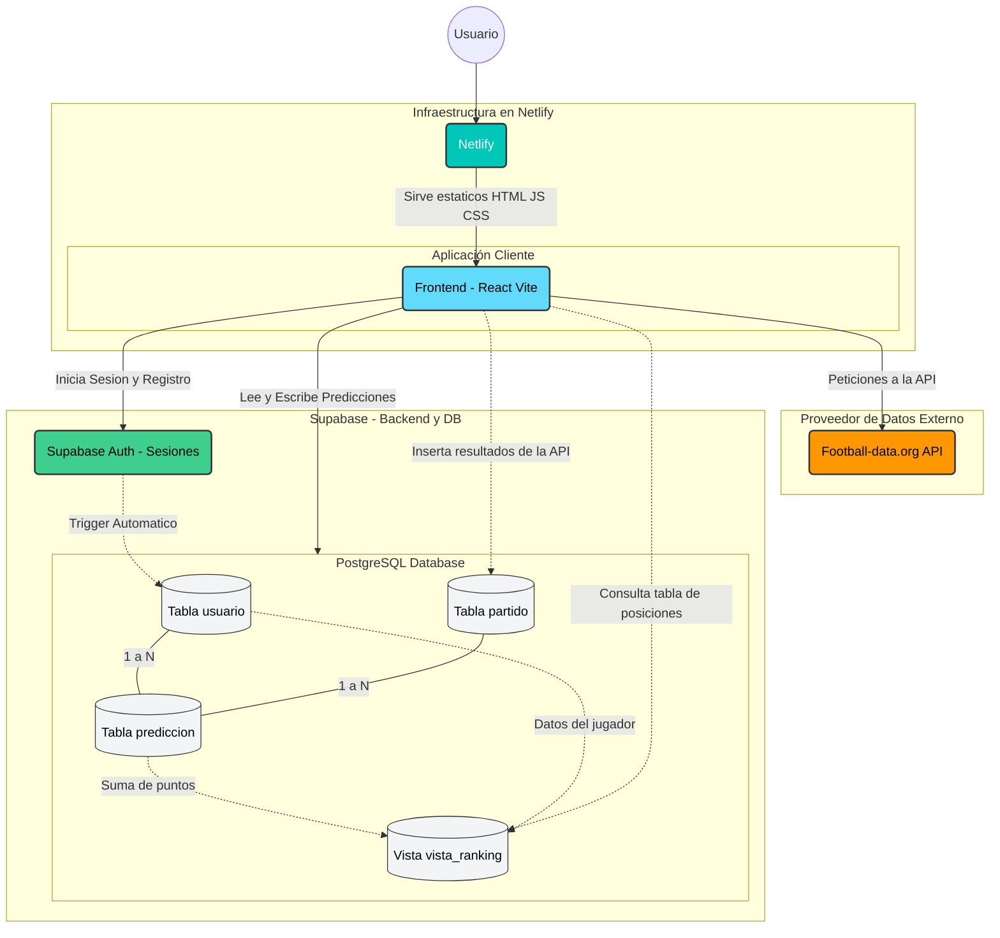
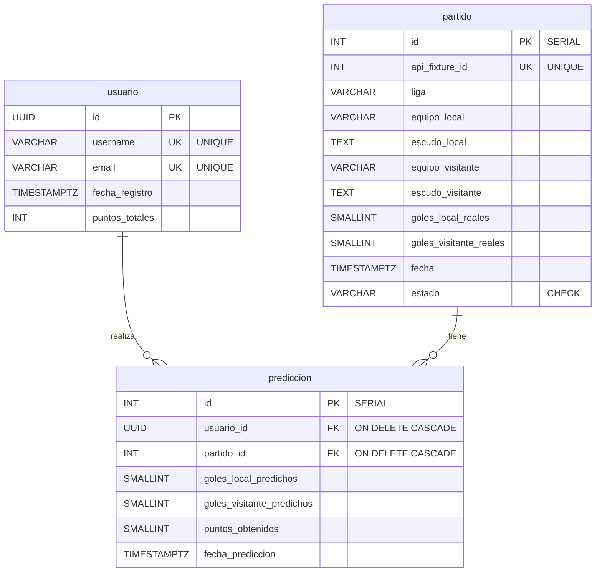

# Ficha Técnica - FutScore

**Proyecto:** Trabajo Práctico Final - Base de Datos 1  
**Materia:** Base de Datos 1  
**Institución:** Universidad de Belgrano - Ingeniería en Informática  
**Integrantes:** Agüero Lucas, Aparicio Santiago, Gianlucca Boffa

---

## 1. Presentación

**FutScore** Web Deportiva donde se podrá:

1. Consultar resultados en vivo, tablas de posiciones y goleadores de las principales ligas europeas y sudamericanas.
2. Participar de un juego interactivo de pronósticos deportivos (Prode), compitiendo en un ranking global.

---

## 2. Presentación Técnica

### Herramientas Utilizadas

* **Base de Datos / Backend:** [Supabase](https://supabase.com/) (PostgreSQL). Elegido por su robustez, soporte nativo para Triggers/Vistas y sistema de autenticación integrado.
* **Frontend:** React + Vite.
* **Estilizado:** Tailwind CSS (Arquitectura de diseño *Glassmorphism* para una estética moderna y fluida).
* **Consumo de Datos Externos:** Integración con `api.football-data.org` para mantener actualizada la información deportiva.

### Bitácora de Avance

* **Semana 1:** Diseño de interfaz base y conexión con API externa. Refactorización visual (*Glassmorphism*) y adaptación responsiva.
* **Semana 2:** Diseño del Modelo Relacional (DER) para integrar el Prode. Implementación de Base de Datos en Supabase (Tablas, Triggers, Vistas).
* **Semana 3:** Integración Full-Stack (Auth, envío de predicciones y visualización de ranking global).

---

## 3. Arquitectura de Base de Datos (PostgreSQL)

El núcleo del proyecto gira en torno a cómo la base de datos gestiona el juego del Prode de manera autónoma, integrándose con una API externa a través del frontend.

> [!NOTE]
> **Documentación Expandida de la Base de Datos**:  
Documento detallado con el diccionario de datos columna por columna, justificación de índices de rendimiento y trazas de ejecución completas de los triggers en [DATABASE_DOC.md](./DATABASE_DOC.md).

> [!NOTE]
> **Documentación de Conexión y Endpoints**: Detalle de cómo se comunican las APIs, el flujo de sincronización de partidos mediante peticiones `fetch` y las operaciones CRUD con el SDK de Supabase, se encuentra en [CONEXION_API_SUPABASE.md](./CONEXION_API_SUPABASE.md).

### Arquitectura del Sistema



### Diagrama de Entidad-Relación (DER)



### Detalle de las Tablas y Restricciones (Constraints)

1. **`usuario`**: Entidad principal vinculada a la autenticación.
   * **Restricciones:** `username` y `email` tienen restricciones `UNIQUE` para evitar duplicados. El campo `id` es un `UUID` que funciona como **Primary Key** y se enlaza directamente con el sistema de Autenticación.

2. **`partido`**: Funciona como la "fuente de la verdad". Almacena qué equipos juegan, a qué liga pertenecen y, una vez finalizado, el resultado real.
   * **Ingesta de Datos:** Se alimenta directamente de una API externa mediante un proceso de *Upsert* (Insert/Update) en React, utilizando `api_fixture_id` como clave única (`UNIQUE`).
   * **Restricciones:** El campo `estado` posee un `CHECK CONSTRAINT` que solo permite los valores fijos: `'programado'`, `'en_curso'` o `'finalizado'`.

3. **`prediccion`**: Tabla intermedia transaccional que rompe la relación Muchos-a-Muchos (N:M) entre `usuario` y `partido`.
   * **Relaciones (Foreign Keys):** Posee claves foráneas `usuario_id` y `partido_id` con comportamiento `ON DELETE CASCADE` (si se borra un usuario o un partido en el futuro, sus predicciones desaparecen para mantener la integridad referencial).
   * **Integridad (Voto Único):** Tiene una restricción de tabla compuesta `UNIQUE (usuario_id, partido_id)` en la base de datos para garantizar matemáticamente que un usuario no pueda votar dos veces por un mismo partido, bloqueando intentos de trampa desde el servidor.

### Código DDL (Data Definition Language)

```sql
-- 1. Tabla de Usuarios (Jugadores del Prode)
CREATE TABLE usuario (
    id             UUID PRIMARY KEY, -- Se vincula con auth.users.id
    username       VARCHAR(50) NOT NULL UNIQUE,
    email          VARCHAR(150) NOT NULL UNIQUE,
    fecha_registro TIMESTAMPTZ DEFAULT NOW(),
    puntos_totales INT DEFAULT 0
);

-- 2. Tabla de Partidos (Fuente de la verdad)
CREATE TABLE partido (
    id                     SERIAL PRIMARY KEY,
    api_fixture_id         INT UNIQUE NOT NULL, -- ID que viene de la API de futbol
    liga                   VARCHAR(100),
    equipo_local           VARCHAR(100) NOT NULL,
    escudo_local           TEXT,
    equipo_visitante       VARCHAR(100) NOT NULL,
    escudo_visitante       TEXT,
    goles_local_reales     SMALLINT, -- Nulo hasta que termine el partido
    goles_visitante_reales SMALLINT,
    fecha                  TIMESTAMPTZ NOT NULL,
    estado                 VARCHAR(20) NOT NULL DEFAULT 'programado'
                               CHECK (estado IN ('programado', 'en_curso', 'finalizado'))
);

-- 3. Tabla de Predicciones (El Prode de los usuarios)
CREATE TABLE prediccion (
    id                        SERIAL PRIMARY KEY,
    usuario_id                UUID NOT NULL REFERENCES usuario(id) ON DELETE CASCADE,
    partido_id                INT NOT NULL REFERENCES partido(id) ON DELETE CASCADE,
    goles_local_predichos     SMALLINT NOT NULL,
    goles_visitante_predichos SMALLINT NOT NULL,
    puntos_obtenidos          SMALLINT DEFAULT 0,
    fecha_prediccion          TIMESTAMPTZ DEFAULT NOW(),
    -- Restricción clave: Un usuario no puede predecir dos veces el mismo partido
    CONSTRAINT uq_usuario_partido UNIQUE (usuario_id, partido_id)
);

-- Índices para mejorar rendimiento de consultas
CREATE INDEX idx_prediccion_usuario ON prediccion(usuario_id);
CREATE INDEX idx_prediccion_partido ON prediccion(partido_id);
CREATE INDEX idx_partido_estado     ON partido(estado);
```

### Lógica de Negocio (Triggers y Vistas)

Para cumplir con los requisitos de la materia, la lógica de asignación de puntos **NO** ocurre en el código frontend (JavaScript), sino directamente en el motor de la base de datos:

* **Trigger (`trg_actualizar_puntos`)**: Cuando la tabla `partido` se actualiza y pasa a estado `'finalizado'`, este trigger dispara una función PL/pgSQL que cruza los goles reales con las predicciones. Otorga 3 puntos por resultado exacto, 1 punto por acertar el ganador/empate, y 0 puntos por fallar. Automáticamente actualiza los `puntos_totales` del `usuario`.
* **Vista (`vista_ranking`)**: Una vista (View) que consolida toda la información mediante un `LEFT JOIN` entre `usuario` y `prediccion`. Cuenta la cantidad de participaciones, aciertos exactos y suma de puntos. El Frontend solo tiene que hacer un `SELECT * FROM vista_ranking` para tener la tabla de posiciones lista.
* **Trigger de Auth (`handle_new_user`)**: Un trigger interno que crea automáticamente el perfil público en la tabla `usuario` cuando alguien se registra en el sistema de Auth de Supabase.

---

## 4. Documentación de Instalación (README)

### Requisitos Previos

* Node.js instalado.
* Una cuenta gratuita en Supabase.
* Una API Key gratuita de [football-data.org](https://www.football-data.org/).

### Configurar el Entorno Local

Archivo `.env` en la raíz del proyecto con las siguientes claves:

```env
VITE_FOOTBALL_DATA_KEY=
VITE_SUPABASE_URL=
VITE_SUPABASE_ANON_KEY=
```

### Ejecutar la aplicación

```bash
npm install
npm run dev
```

La aplicación estará disponible en `http://localhost:5173`.
